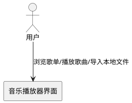
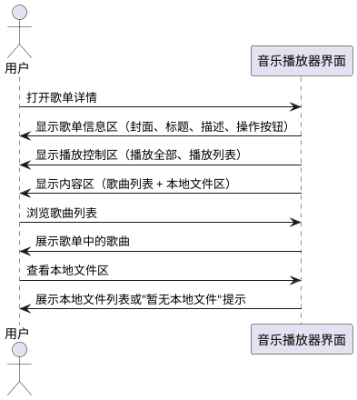
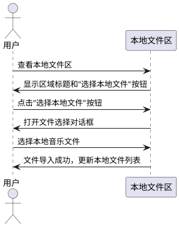
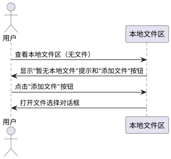

# **1. 组件定位**

## **1.1 核心职责**

本组件负责优化音乐播放器界面的布局结构，解决按钮遮挡和视觉层级混乱问题，实现清晰的功能分区和流畅的视觉动线。

## **1.2 核心输入**

1. 用户对界面布局问题的反馈：绿色"选择本地文件"按钮遮挡功能键，"暂无本地文件"提示遮挡歌曲列表
2. 现有界面的布局结构和元素位置关系
3. 用户对功能模块划分的期望：歌单信息区、播放控制区、内容区清晰分离

## **1.3 核心输出**

1. 优化后的界面布局结构，各功能模块清晰分离，无遮挡问题
2. 调整后的按钮位置，"选择本地文件"按钮移至合理区域
3. 优化后的视觉层级，"暂无本地文件"提示置于独立模块内

## **1.4 职责边界**

本组件不负责：
1. 修改音乐播放器的核心播放功能逻辑
2. 改变歌曲列表的数据结构和加载方式
3. 重新设计整体UI风格和配色方案
4. 优化网络请求性能和加载速度

# **2. 领域术语**

**功能模块**
: 界面中承担特定业务功能的独立区域，具有明确的视觉边界和职责范围。

**视觉动线**
: 用户浏览界面时视线移动的自然路径，从上到下、从左到右的信息流顺序。

**视觉层级**
: 界面元素在垂直方向上的层次关系，决定用户对信息重要性的感知顺序。

**遮挡问题**
: 界面元素在位置上重叠或间距过小，导致功能键无法正常点击或视觉混淆的情况。

**本地文件区**
: 专门展示用户导入的本地音乐文件的独立模块，与歌单内容区分离。

# **3. 角色与边界**

## **3.1 核心角色**

用户：使用音乐播放器浏览歌单、播放歌曲、导入本地文件的操作者

## **3.2 外部系统**

无外部系统依赖，本组件仅涉及前端界面布局调整

## **3.3 交互上下文**

# **4. DFX约束**

## **4.1 性能**

1. 界面布局调整后，页面渲染时间不得超过原有时长的110%
2. 用户操作响应时间不得超过200毫秒

## **4.2 可靠性**

1. 布局调整后，所有原有功能必须保持可用，不得出现功能缺失
2. 界面在不同屏幕尺寸下必须保持布局合理性，不得出现新的遮挡问题

## **4.3 安全性**

无特殊安全要求，本组件不涉及数据传输和存储

## **4.4 可维护性**

1. 布局代码必须使用语义化的结构，便于后续维护
2. 模块划分必须清晰，各区域职责明确

## **4.5 兼容性**

1. 布局调整必须兼容现有浏览器环境
2. 不得破坏现有功能的交互逻辑

# **5. 核心能力**

## **5.1 界面布局重构**

### **5.1.1 业务规则**

1. **功能模块划分规则**：界面必须划分为三个清晰区域：歌单信息区、播放控制区、内容区

   a. 验收条件：[用户浏览界面] → [能够清晰识别三个功能区域]

2. **歌单信息区规则**：歌单信息区必须包含封面、标题、描述、操作按钮（收藏、下载、评论、分享）

   a. 验收条件：[用户查看歌单] → [在顶部看到完整的歌单信息和操作按钮]

3. **播放控制区规则**：播放控制区必须包含"播放全部"按钮和播放列表按钮，不得包含"选择本地文件"按钮

   a. 验收条件：[用户查看播放控制区] → [仅看到播放相关按钮，无文件导入按钮]

4. **内容区规则**：内容区必须包含歌曲列表和本地文件区，两个子区域必须有明确的视觉分隔

   a. 验收条件：[用户浏览内容区] → [能够区分歌曲列表和本地文件区]

5. **禁止项**：禁止将"选择本地文件"按钮放置在播放控制区

   a. 验收条件：[用户查看播放控制区] → [不出现"选择本地文件"按钮]

### **5.1.2 交互流程**

### **5.1.3 异常场景**

1. **屏幕尺寸过小场景**

   a. 触发条件：[用户设备屏幕宽度小于768px]

   b. 系统行为：[调整布局为响应式设计，保持功能可用性]

   c. 用户感知：[界面自适应屏幕尺寸，无遮挡问题]

2. **本地文件区内容过多场景**

   a. 触发条件：[用户导入大量本地文件]

   b. 系统行为：[本地文件区显示滚动条，不影响歌曲列表展示]

   c. 用户感知：[能够滚动查看本地文件，歌曲列表正常显示]

## **5.2 按钮位置优化**

### **5.2.1 业务规则**

1. **"选择本地文件"按钮位置规则**：该按钮必须移至本地文件区域内部，作为该区域的操作按钮

   a. 验收条件：[用户查看本地文件区] → [在区域内看到"选择本地文件"按钮]

2. **按钮视觉权重规则**："选择本地文件"按钮的视觉权重必须与本地文件区的其他元素协调，不得过于突兀

   a. 验收条件：[用户浏览本地文件区] → [按钮视觉风格与区域整体协调]

3. **按钮功能定位规则**："选择本地文件"按钮必须明确其功能为"导入本地文件"，而非"播放控制"

   a. 验收条件：[用户点击按钮] → [打开文件选择对话框，而非播放相关功能]

4. **禁止项**：禁止"选择本地文件"按钮遮挡歌曲列表或播放控制区的任何元素

   a. 验收条件：[用户查看界面] → [所有功能键均无遮挡，可正常点击]

### **5.2.2 交互流程**

### **5.2.3 异常场景**

1. **文件导入失败场景**

   a. 触发条件：[用户选择的文件格式不支持或文件损坏]

   b. 系统行为：[显示错误提示，不更新本地文件列表]

   c. 用户感知：[看到"文件导入失败，请检查文件格式"提示]

2. **按钮点击无响应场景**

   a. 触发条件：[系统权限不足，无法访问本地文件]

   b. 系统行为：[显示权限申请提示]

   c. 用户感知：[看到"需要文件访问权限"提示]

## **5.3 视觉层级优化**

### **5.3.1 业务规则**

1. **"暂无本地文件"提示位置规则**：该提示必须完全置于本地文件区块内部，不得悬浮在歌单内容区

   a. 验收条件：[用户查看本地文件区] → [提示在区域内显示，不干扰歌曲列表]

2. **模块视觉分隔规则**：歌曲列表与本地文件区之间必须有明确的视觉分隔（背景色、分隔线或卡片式设计）

   a. 验收条件：[用户浏览内容区] → [能够清晰区分两个子区域]

3. **提示内容规则**："暂无本地文件"提示必须包含引导用户操作的元素（如"点击添加"按钮）

   a. 验收条件：[用户看到提示] → [能够直接点击按钮添加文件]

4. **禁止项**：禁止"暂无本地文件"提示遮挡歌曲列表的任何内容

   a. 验收条件：[用户查看歌曲列表] → [列表内容完整显示，无遮挡]

### **5.3.2 交互流程**

### **5.3.3 异常场景**

1. **提示信息过长场景**

   a. 触发条件：[提示文本超出区域宽度]

   b. 系统行为：[自动换行或省略显示，保持布局稳定]

   c. 用户感知：[提示完整可读，布局不变形]

# **6. 数据约束**

## **6.1 界面布局结构**

1. **歌单信息区位置**：必须位于界面顶部，占据独立区域

2. **播放控制区位置**：必须位于歌单信息区下方，与内容区有明确分隔

3. **内容区位置**：必须位于播放控制区下方，占据界面主要空间

4. **本地文件区位置**：必须位于内容区内部，与歌曲列表并列或上下排列

## **6.2 按钮元素**

1. **"选择本地文件"按钮位置**：必须位于本地文件区域内部

2. **"选择本地文件"按钮功能**：必须触发文件选择对话框，而非播放控制

3. **按钮视觉权重**：必须与所在区域的视觉风格协调

## **6.3 提示信息**

1. **"暂无本地文件"提示位置**：必须位于本地文件区域内部

2. **提示内容**：必须包含引导用户操作的元素

3. **提示视觉层级**：必须低于歌曲列表的视觉层级，不干扰主要内容
